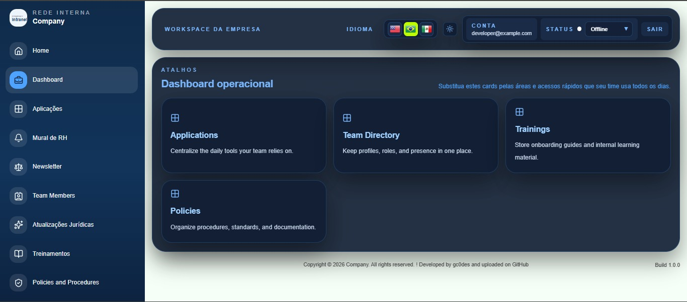
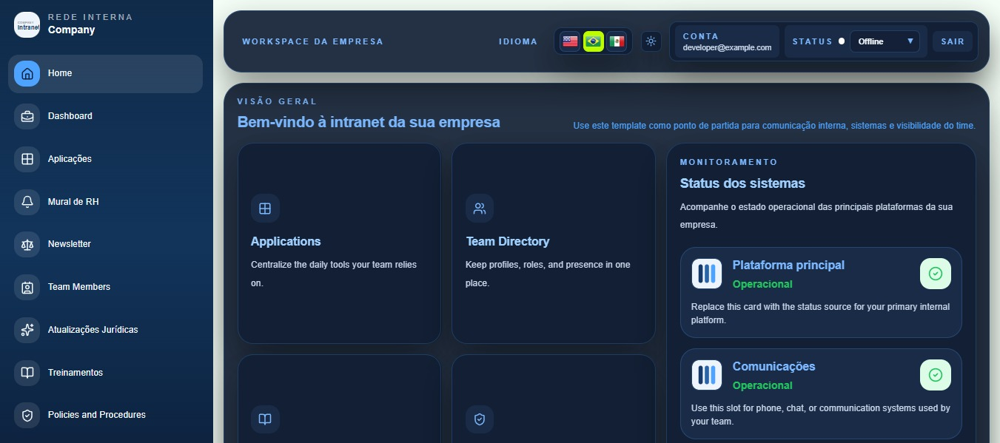
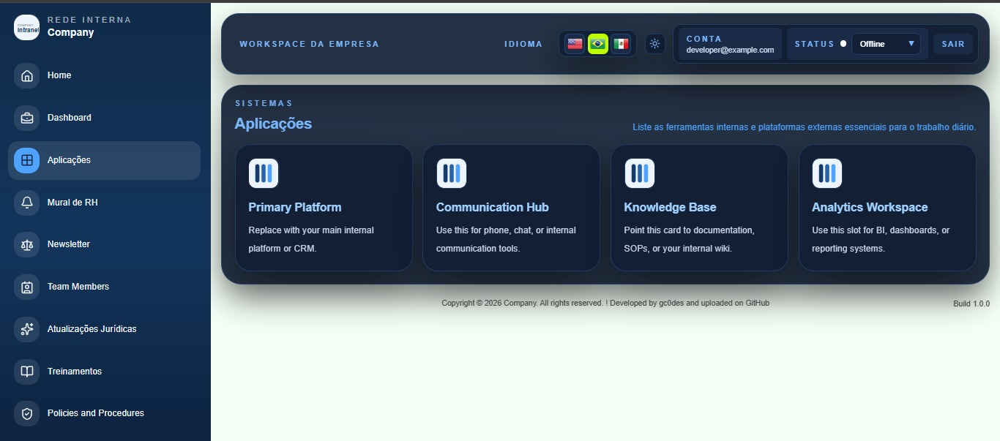
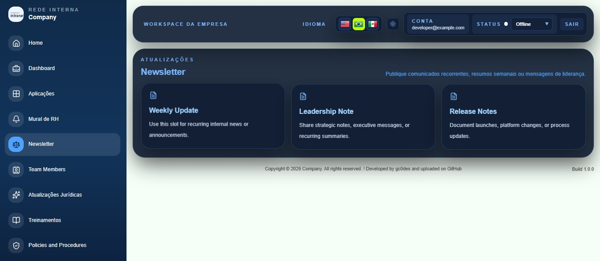
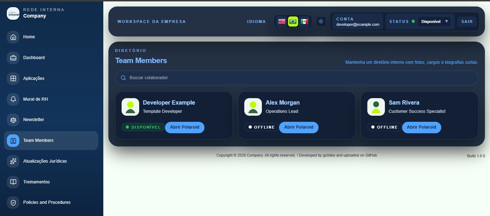
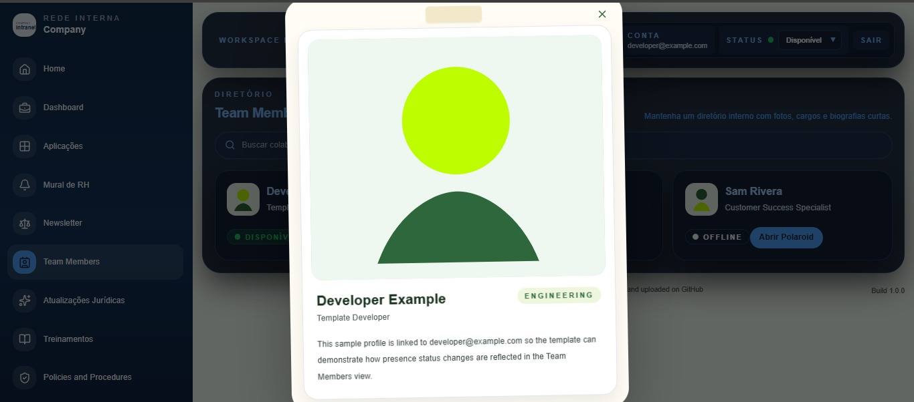
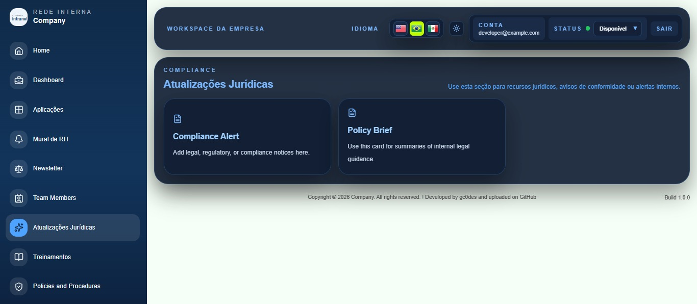
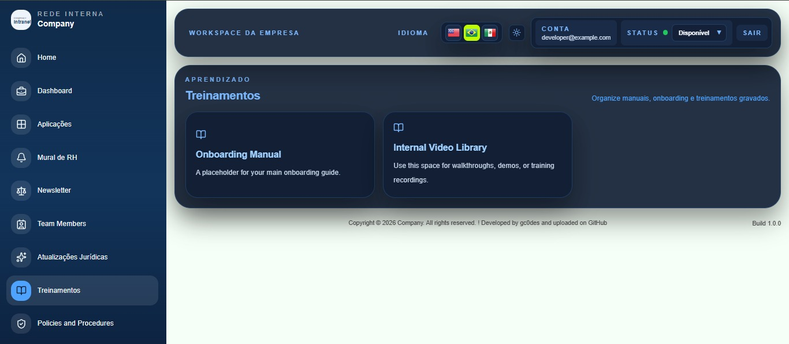
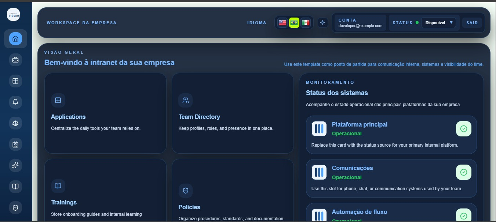

# Intranet Template 1.0.0

A reusable React + Vite intranet template with:

- login entry screen
- sidebar navigation
- dark mode
- multilingual structure
- team directory with presence status
- dashboard, policies, newsletter, training, and status sections

## Setup

1. Install dependencies:
   npm install
2. Replace the sample login action with the authentication flow of your choice.
3. Start development:
   npm run dev

## Notes

- Replace sample team members in `src/data/`
- Replace placeholder assets in `src/assets/`
- Replace placeholder links and documents in `src/views/AppView.jsx`
- Adjust branding in `src/data/i18n.data.js`

## Login module

The template now opens on a generic login entry screen and moves into the intranet when the user clicks the sample Login button. Developers can replace this action with any authentication provider or internal access flow.

## Screenshots

### Home and Dashboard

### Applications

### Newsletter

### Team Members

### Legal Updates

### Trainings

### Collapsed Sidebar

